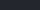
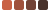
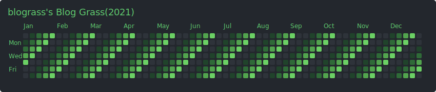
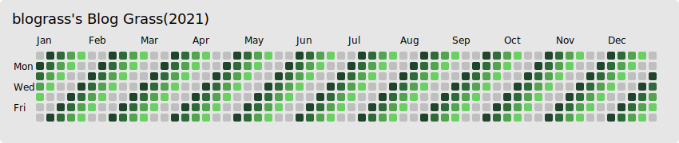
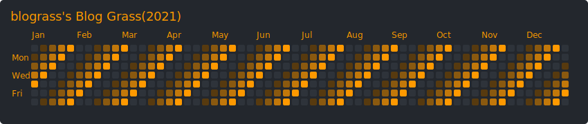
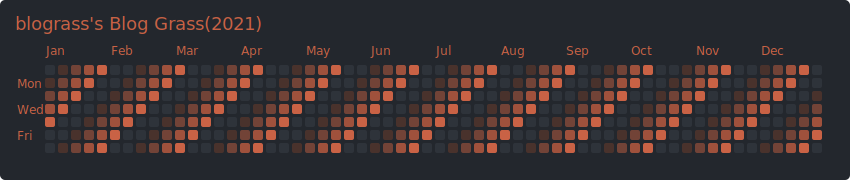
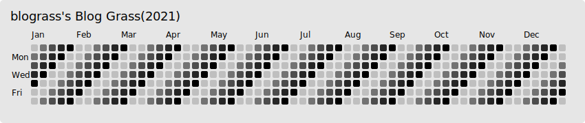

----

<p align='center'>많은 개발자들은, 자신의 github 잔디를 채웁니다</p>
<p align='center'>이 잔디는 개발에 대한 열정과 꾸준함을 한눈에 보여주죠</p>
<p align='center'>그런데 어떤 개발자들은, 자신이 배운것을 블로그에 포스팅 합니다</p>
<p align='center'>그리고 다른 개발자들은 이 포스트들을 보고 새로운 정보를 알아가고있죠</p>
<p align='center'>우리는 이렇게 얻은 정보들로 하나의 commit, 한칸의 잔디를 채워나갑니다</p>
<p align='center'>이러한 선순환에 기여하는 블로거들이 자신의 열정을 보여줄 수 있도록</p>
<p align='center'>또 하나의 방법을 제공하고자, blograss를 개발하게 되었습니다</p>
<p align='center'>blograss를 사용하여 당신의 블로깅 열정을 보여주세요!</p>
<br>
<p align='center'><b>Easy to show your passion of blogging 👨‍💻</b></p>
<br>
<p align='center'>읽어주셔서 감사합니다</p>

----

# 목차
1. <a href="#사용법">사용법</a>
2. <a href="#옵션">옵션</a>
    <br>2-1. <a href="#blog_typerequired">blog_type(required)</a>
    <br>2-2. <a href="#blog_namerequired">blog_name(required)</a>
    <br>2-3. <a href="#year">year</a>
    <br>2-4. <a href="#size">size</a>
    <br>2-5. <a href="#darkmode">darkMode</a>
    <br>2-6. <a href="#text_color">text_color</a>
    <br>2-7. <a href="#grass_color">grass_color</a>
3. <a href="#샘플">샘플</a>


# 사용법     

- Markdown
```

```

- HTML
```

```

# 옵션
query string 입니다.

### **blog_type(required)**
`tistory`

:exclamation: 현재는 `tistory` 타입만 제공됩니다.(타 블로그도 업로드 예정)

<br>

### **blog_name(required)**
tistory 블로그 도메인 앞의 블로그 이름을 입력하시면 됩니다.
> ex) https://`blog_name`.tistory.com

<br>

### **year**
`yyyy` ex) `2021`
(default) this year

<br>

### **size**
`large` : 750px, 180px (default)<br>
`middle` : 412px, 180px<br>
`small` : 242px, 180px<br>
<br>

### **darkMode**

- `true` (default)
    background color : 
- `false`
    background color : 
    <br>

### **text_color**
`green`(default), `orange`, `brown`, `black`, `white`

### **grass_color**
`more` ~ `less`
- **green** (default)
    
- **orange**
    
- **brown**
    
- **black** 
    
- **white**
    

# 샘플
- **green grass theme**
    ```http
    https://blograss.vercel.app/api?blog_type=tistory&blog_name=blograss&grass_color=black&text_color=white&darkMode=false
    ```
    
    
    - optinos `grass_color=green`, `text_color=green`, `darkMode=true`
    <br>
    
    ```http
    https://blograss.vercel.app/api?blog_type=tistory&blog_name=blograss&grass_color=black&text_color=white&darkMode=false
    ```
    
    
    - optinos `grass_color=green`, `text_color=black`, `darkMode=false`
    <br>

- **orange grass theme**
    ```http
    https://blograss.vercel.app/api?blog_type=tistory&blog_name=blograss&grass_color=black&text_color=white&darkMode=false
    ```
    
    
    - optinos `grass_color=orange`, `text_color=orange`, `darkMode=true`
    <br>

- **brown grass theme**
    ```http
    https://blograss.vercel.app/api?blog_type=tistory&blog_name=blograss&grass_color=black&text_color=white&darkMode=false
    ```
    
    
    - optinos `grass_color=brown`, `text_color=brown`, `darkMode=true`
    <br>
- **black grass theme**
    ```http
    https://blograss.vercel.app/api?blog_type=tistory&blog_name=blograss&grass_color=black&text_color=black&dark_mode=false
    ```
    

    - optinos `grass_color=black`, `text_color=black`, `dark_mode=false`
    <br>

- **white grass theme**
    ```http
    https://blograss.vercel.app/api?blog_type=tistory&blog_name=blograss&grass_color=white&text_color=white
    ```
    
    
    - optinos `grass_color=white`, `text_color=white`, `darkMode=true`
    <br>


